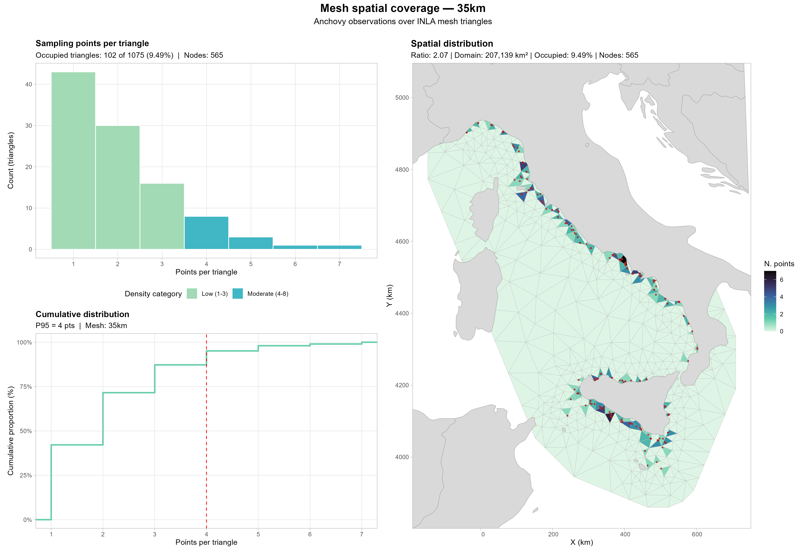
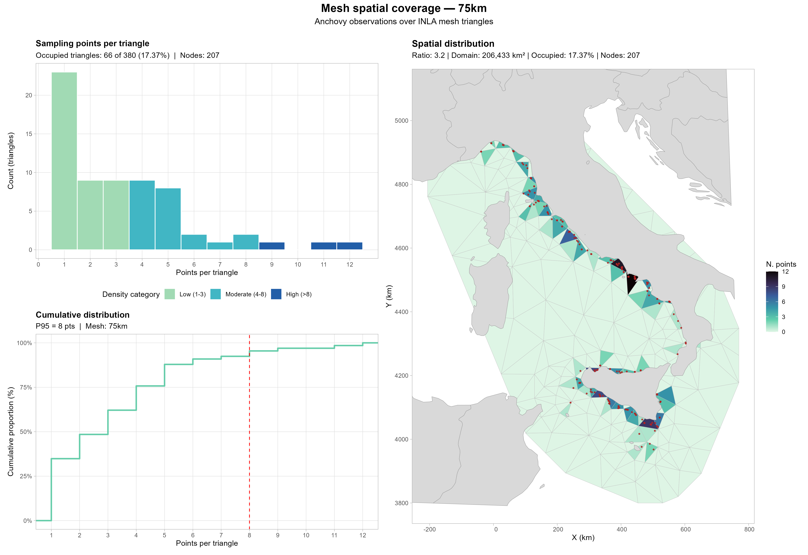
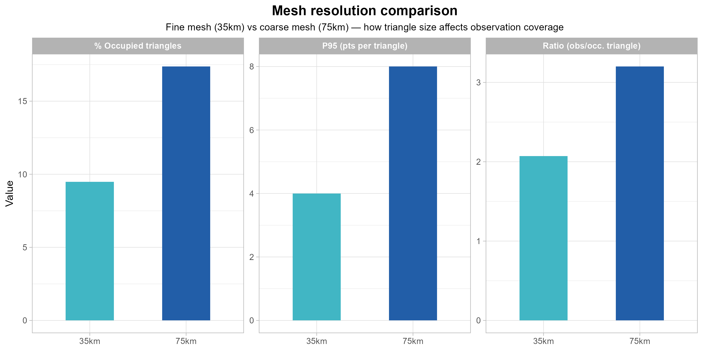
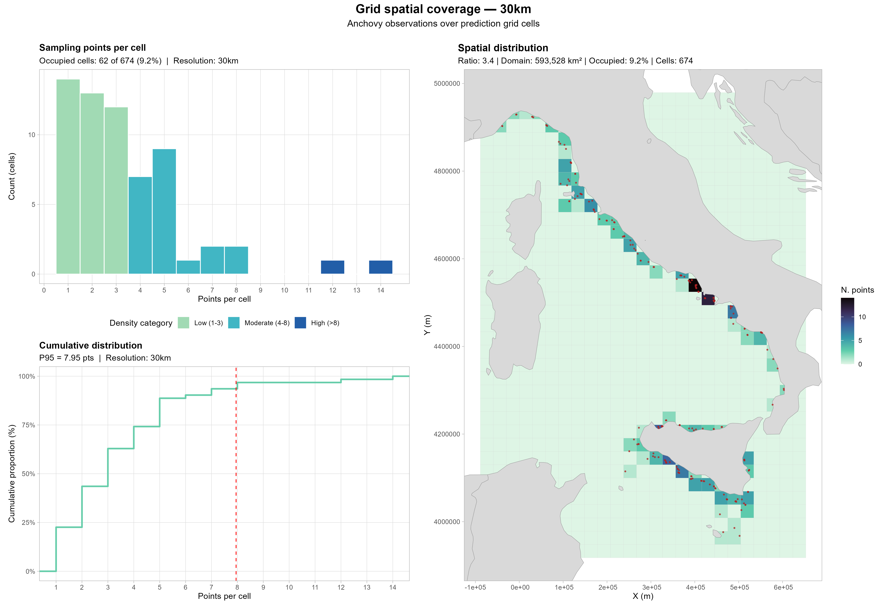
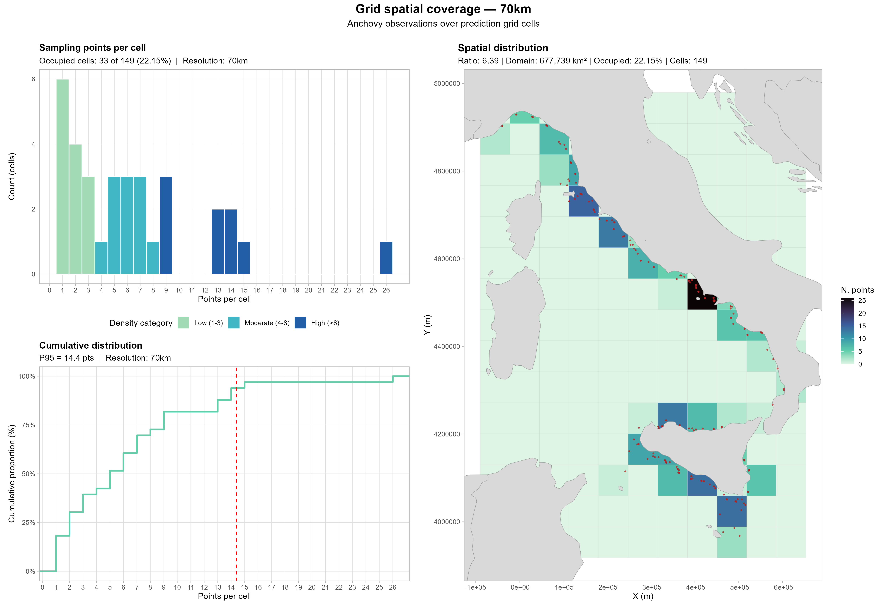
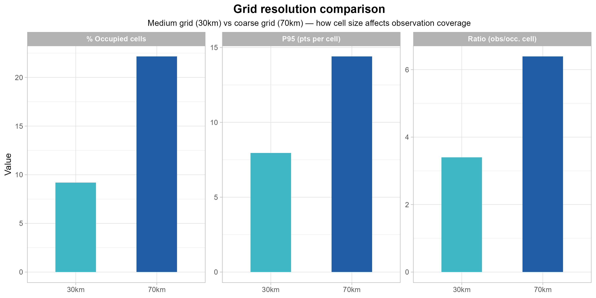

**Francisco Izquierdo**  
`r format(Sys.Date(), "%d %B %Y")`

```{r setup}
#| include: false

library(knitr)
library(kableExtra)
```

## What this does

When building a species distribution model (SDM), you choose a **spatial domain**, the area over which the model will predict. This domain is discretised into spatial units:

- **Triangles** if you use a mesh (e.g. sdmTMB or R-INLA)
- **Cells** if you use a regular prediction grid (e.g. GAM, GLM, or BART)

Before fitting an SDM, it is useful to check whether observations are well distributed across the prediction domain.

| Script | Spatial unit | Core function | Use case |
|--------|-------------|--------------|----------|
| `mesh_coverage.R` | INLA mesh triangles | `run_mesh_coverage()` | sdmTMB, R-INLA |
| `grid_coverage.R` | Regular raster cells | `run_grid_coverage()` | GAM, GLM, BART |

## Why it matters

### Too many observations per unit → nugget risk

If many observations fall within the same triangle or cell, the model may not resolve fine-scale variability well. In geostatistics, this is related to the **nugget effect**: variance at very short distances appears as noise because the model discretisation is too coarse relative to the data.

::: {.callout-note appearance="minimal"}
This idea is closely related to the SPDE approach described by Lindgren et al. (2011), where the relationship between spatial resolution and short-scale variability is discussed in the context of Gaussian random fields and mesh-based approximations.

**Reference**  
Lindgren, F., Rue, H., & Lindström, J. (2011).  
An explicit link between Gaussian fields and Gaussian Markov random fields: the stochastic partial differential equation approach.  
*Journal of the Royal Statistical Society: Series B*, 73(4), 423–498.
:::

### Too few occupied units → extrapolation risk

If only a small fraction of units contains any observation, the model predicts mostly by extrapolation. This is not necessarily wrong, but it is useful to be aware of it before fitting the model.

## Examples

::: {.callout-note appearance="minimal"}

This is a simple toy example using anchovy presences (2014–2020) in the Mediterranean Sea.

The meshes and grids shown here are only used to illustrate how the function work for both mesh-based and grid-based cases.
:::

::: {.panel-tabset}

### 🔺 Mesh coverage

**Script:** `mesh_coverage.R` · **Use case:** sdmTMB, R-INLA

The INLA mesh divides the spatial domain into **irregular triangles**. We compare two resolutions:

| File | MaxEdge (inner) | Character |
|------|----------------|-----------|
| `mesh_inla_35km.rds` | ~37.5 km | Fine |
| `mesh_inla_75km.rds` | ~75 km | Coarse |

::: {.panel-tabset}

#### Fine mesh — 35 km

```{r}
#| echo: false
#| out-width: 100%


```

#### Coarse mesh — 75 km

```{r}
#| echo: false
#| out-width: 100%


```

#### Comparison

```{r}
#| echo: false

comp_mesh <- read.csv(
  "output/mesh_coverage_output/mesh_coverage_comparison.csv",
  check.names = FALSE
)

kable(
  comp_mesh,
  caption = "Coverage metrics by mesh resolution"
) |>
  kable_styling(
    bootstrap_options = c("striped", "hover", "condensed"),
    full_width = FALSE,
    position = "left"
  )
```

```{r}
#| echo: false
#| out-width: 80%


```

:::

### 🔲 Grid coverage

**Script:** `grid_coverage.R` · **Use case:** GAM, GLM, BART, RF, MaxEnt…

For raster-based SDMs, the prediction domain is a **regular grid**. We compare two resolutions:

| File | Cell size | Character |
|------|-----------|-----------|
| `grid_30km.tif` | 30 km | Medium |
| `grid_70km.tif` | 70 km | Coarse |

::: {.panel-tabset}

#### Medium grid — 30 km

```{r}
#| echo: false
#| out-width: 100%


```

#### Coarse grid — 70 km

```{r}
#| echo: false
#| out-width: 100%


```

#### Comparison

```{r}
#| echo: false

comp_grid <- read.csv(
  "output/grid_coverage_output/grid_coverage_comparison.csv",
  check.names = FALSE
)

kable(
  comp_grid,
  caption = "Coverage metrics by grid resolution"
) |>
  kable_styling(
    bootstrap_options = c("striped", "hover", "condensed"),
    full_width = FALSE,
    position = "left"
  )
```

```{r}
#| echo: false
#| out-width: 80%


```

:::

:::

## Coverage metrics

For each spatial unit (triangle or cell), three summary metrics are computed:

| Metric | Definition | What it indicates |
|--------|-----------|-------------------|
| **% Occupied** | Fraction of units with ≥ 1 observation | Geographic coverage of the prediction domain |
| **Ratio** | Total observations / occupied units | Mean data density per occupied unit |
| **P95** | 95th percentile of observations per unit | Clustering — robust to extreme values |

### Practical interpretation

::: {.callout-warning}
These are simple heuristic ranges for exploratory interpretation only. They are not formal thresholds and should not be used as decision rules.
:::

| Metric | Range | Interpretation |
|--------|-------|----------------|
| Ratio | < 1.5 | Too coarse — loss of spatial detail |
| Ratio | 1.5–3 | Good balance |
| Ratio | > 3 | Too fine — many empty units |
| P95 | < 5 | Well distributed |
| P95 | 5–8 | Moderate clustering |
| P95 | > 8 | High clustering |
| % Occupied | < 10% | Most of the domain unobserved |
| % Occupied | 10–30% | Moderate geographic coverage |
| % Occupied | > 30% | Good geographic coverage |